# TermiWatch

Terminal Watch Face for Apple Watch.

| 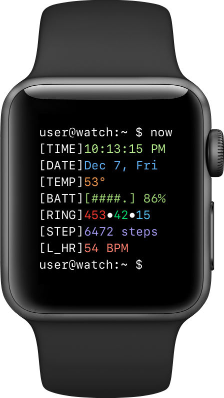 | 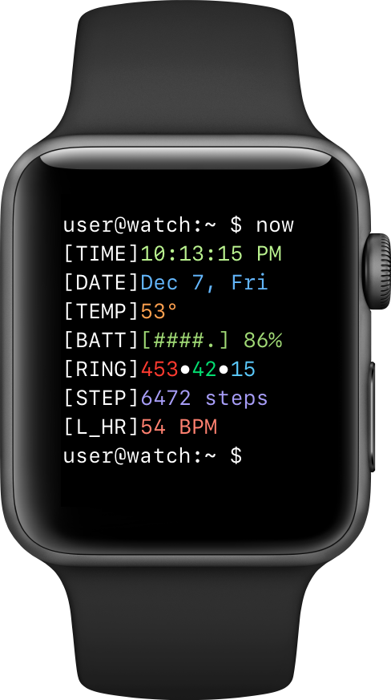 | 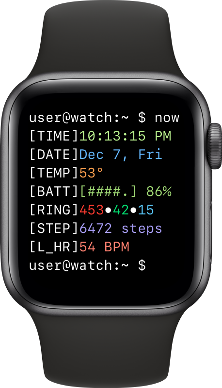 | 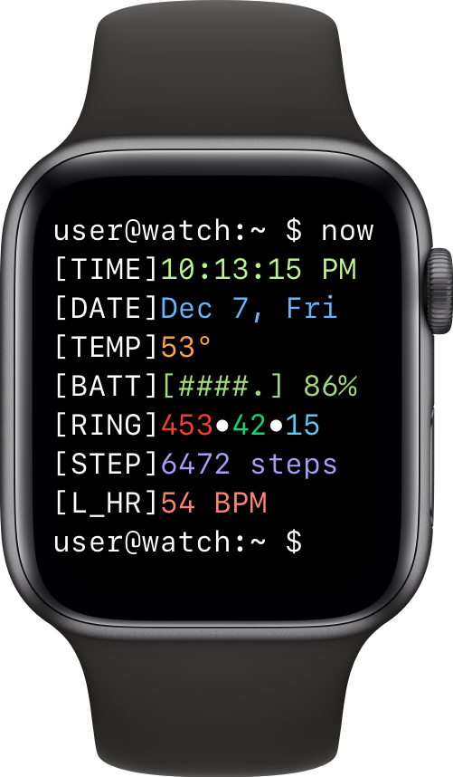 |
| :---: | :---: | :---: | :--: |
| 38 mm | 42 mm | 40 mm | 44 mm|

Inspired by [this](https://www.reddit.com/r/unixporn/comments/9ndo8o/oc_always_keep_some_terminal_with_you/) post on Reddit by u/quarl0w.

For devices running watchOS 5 or higher.

# How to install

## Prerequisites
  1. Install [Xcode](https://itunes.apple.com/app/xcode/id497799835).
  1. Become an Apple Developer by logging in [here](https://developer.apple.com). (Select **Account** and log in with your Apple ID.)

## Adding a developer account to Xcode
  1. Go to **Xcode** menu -> **Xcode** -> **Preferences…**.
  1. Select the **Accounts** tab.
  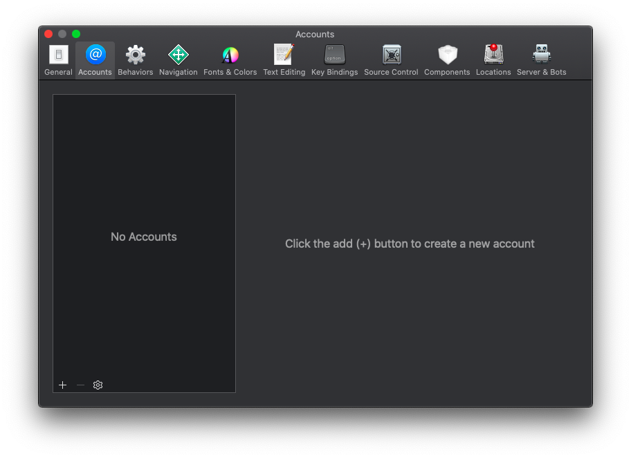
  1. Click the **+** button in the bottom left corner.
      1. Select **Apple ID**.
      1. Provide your Apple ID and password.
  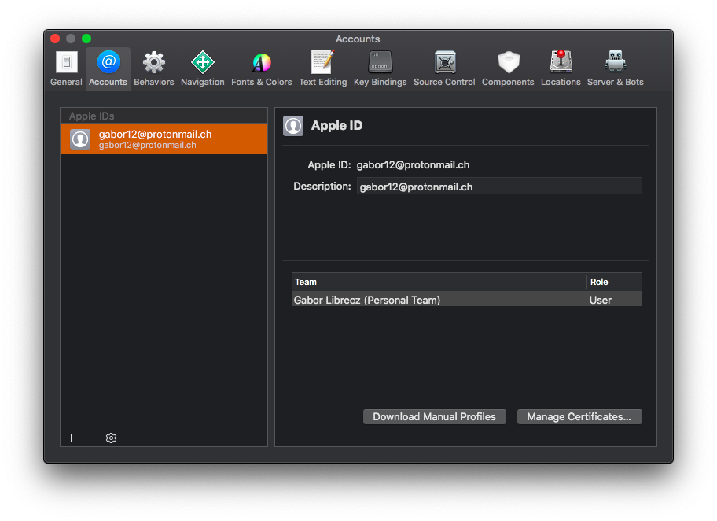
  1. Click the **Manage Certificates…** button.
      1. Click the **+** button in the bottom left corner.
      1. Select **Apple Development**.
      1. Click the **Done** button.
  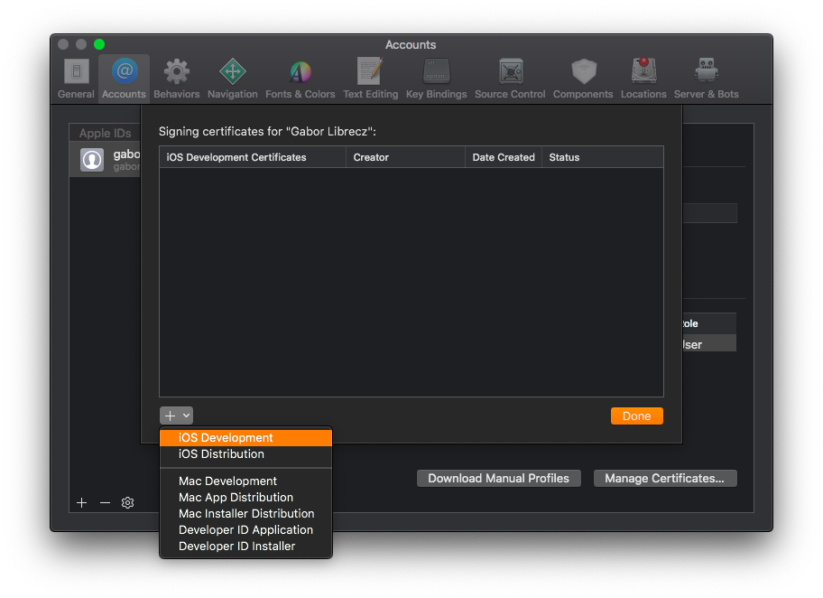

## Configuring the project
  1. Download the latest version:
  - **Xcode 11 or later**: https://github.com/kuglee/TermiWatch/archive/master.zip
  - Xcode 10.2: https://github.com/kuglee/TermiWatch/releases/latest  
  - Xcode 10.1 and older: https://github.com/kuglee/TermiWatch/releases/1.1.1
  1. Open **TermiWatch.xcodeproj** in **Xcode**.
  1. Change the project's developer account:
      1. Select the project in the **Project Navigator**.
      1. Click the **Show project and targets list** button in the top left corner.
      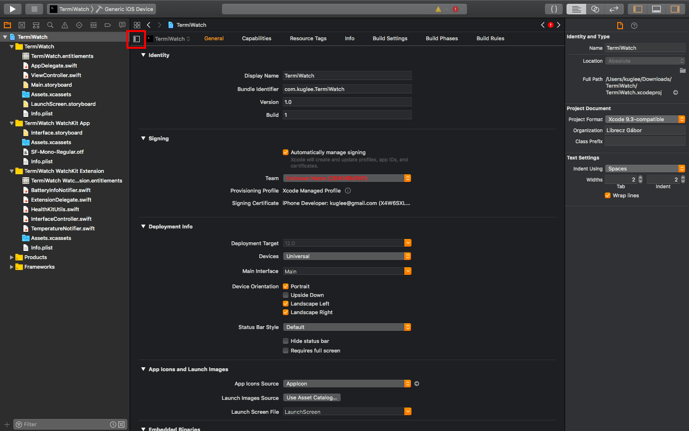
      1. Select the **General** tab:  
      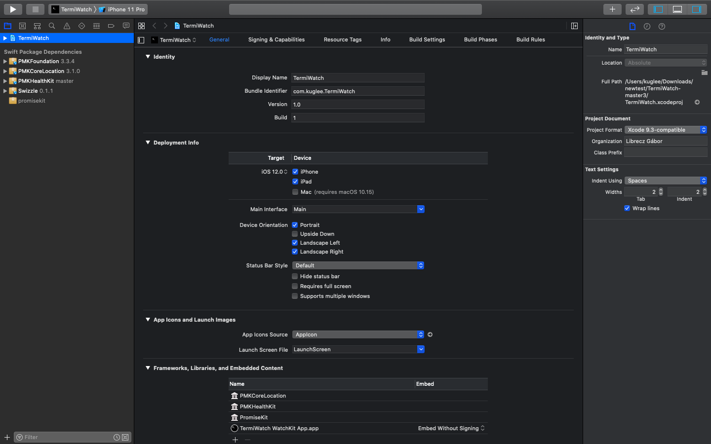
      1. For each of the 3 **targets** replece *kuglee* in the **Bundle Identifier** field with the name of your developer account. (The name of your Apple ID without the *@xxxx.com*.)
      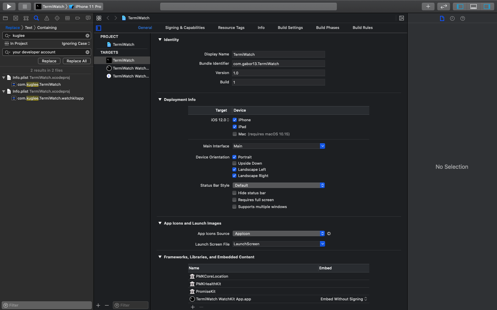
  1. Change the project's team:
      1. Select the **Signing & Capabilities** tab:    
        
      1. For each of the 3 **targets** change the **Team** to your team. (Usually this is your name.)  
          
  1. Manually replace bundle identifiers:
      1. Select **Xcode** menu -> **Find** -> **Find and Replace in Project…**.
      1. In the **Text** field type *kuglee*.
      1. In the **With** field type the name of your developer account. (The name of your Apple ID without the @xxxx.com.)
      1. Click the **Replace All** button.
  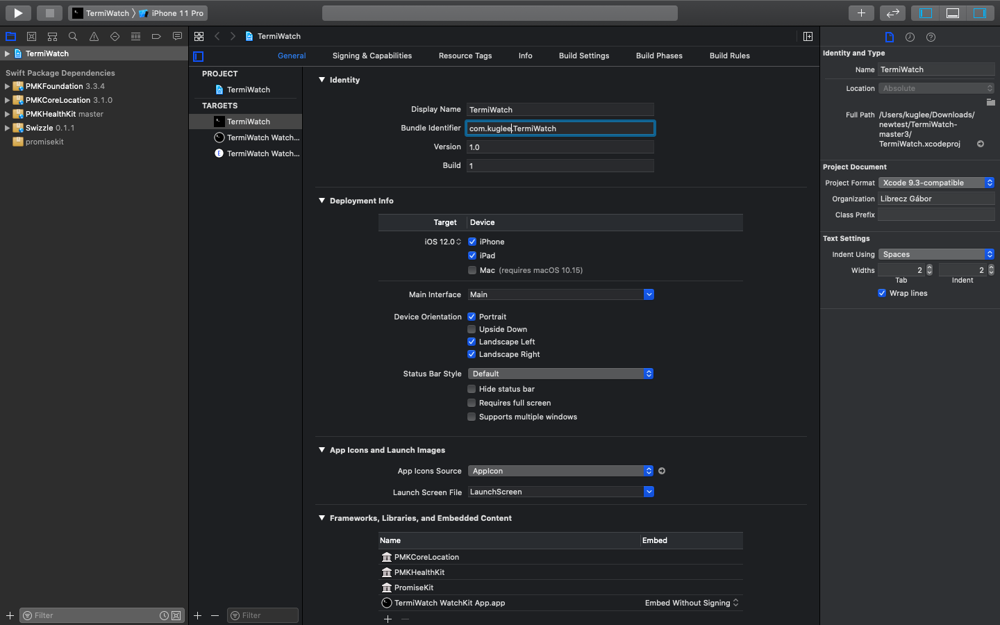

## Installing the app
  1. Plug your phone into your computer.
  1. Unlock your phone and trust your computer.
  1. Select **Xcode** menu -> **Product** -> **Destination**. At the **Device** section select your phone.
  1. Select **Xcode** menu -> **Product** -> **Run**.
  1. Wait for the app to install on your phone.
  1. Go to **Settings** -> **General** -> **Profiles & Device Management** on your phone to trust the app.
  1. Install the watchOS app from the **Watch** app.
  1. Change your watch settings to Always show last used app.
