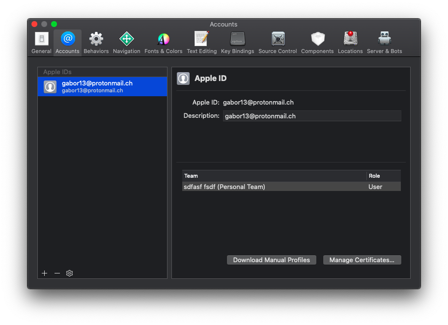
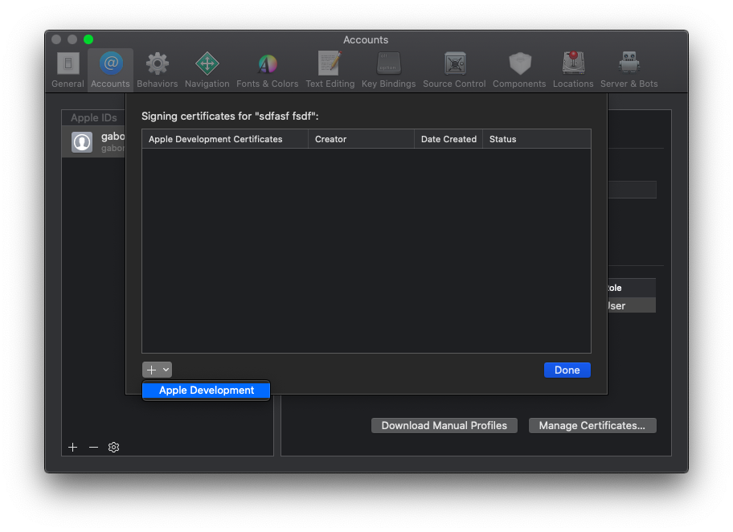
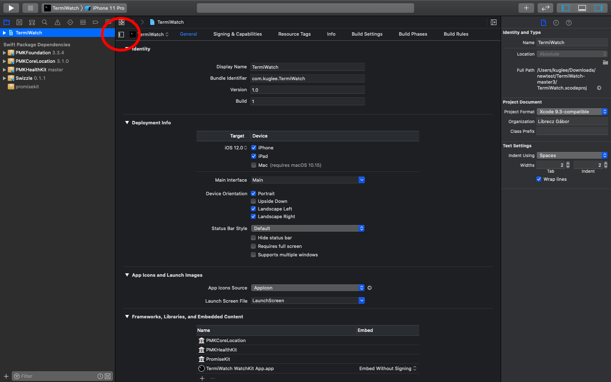

# TermiWatch

Terminal Watch Face for Apple Watch.

|  |  |  |  |
| :---: | :---: | :---: | :--: |
| 38 mm | 42 mm | 40 mm | 44 mm|

Inspired by [this](https://www.reddit.com/r/unixporn/comments/9ndo8o/oc_always_keep_some_terminal_with_you/) post on Reddit by u/quarl0w.

For devices running watchOS 4 or higher.

# How to install

## Prerequisites
  1. Install [XCode](https://itunes.apple.com/app/xcode/id497799835).
  1. Become an Apple Developer by enrolling [here](https://developer.apple.com/programs/enroll/).

## Adding a developer account to Xcode
  1. Go to **XCode** menu -> **Xcode** -> **Preferences…**.
  1. Select the **Accounts** tab.
  
  1. Click the **+** button in the bottom left corner.
      1. Select **Apple ID**.
      1. Provide your Apple ID and password.
  
  1. Click the **Manage Certificates…** button.
      1. Click the **+** button in the bottom left corner.
      1. Select **iOS Development**.
      1. Click the **Done** button.
  

## Configuring the project
  1. Download the [latest version](https://github.com/kuglee/TermiWatch/releases/latest).
  1. Open **TermiWatch.xcodeproj** in **XCode**.
  1. Change the project's developer account:
      1. Select the project in the **Project Navigator**.
      1. Click the **Show project and targets list** button in the top left corner.
  
  1. For each of the 3 **targets**:
      1. Replece *kuglee* with the name of your developer account. (The name of your Apple ID without the *@xxxx.com*.)
      1. Change the **Team** to your team. (Usually this is your name.)
  
  1. Manually replace bundle identifiers:
      1. Select **XCode** menu -> **Find** -> **Find and Replace in Project…**.
      1. In the **Text** field type *kuglee*.
      1. In the **With** field type with then name of your developer account.
      1. Click the **Replace All** button.
  

## Installing the app
  1. Plug your phone into your computer.
  1. Unlock your phone and trust your computer.
  1. Select **XCode** menu -> **Product** -> **Destination**. At the **Device** section select your phone.
  1. Select **XCode** menu -> **Product** -> **Run**.
  1. Wait for the app to install on your phone.
  1. Go to **Settings** -> **General** -> **Profiles & Device Management** on your phone to trust the app.
  1. Install the watchOS app from the **Watch** app.
  1. Change your watch settings to Always show last used app.
